# 🏗️ Wallet System Backend - Architecture Documentation

> **Version**: 1.0.0  
> **Framework**: NestJS 11 + TypeORM + PostgreSQL  
> **Last Updated**: January 9, 2026

---

## 📚 Table of Contents

1. [System Overview](#system-overview)
2. [Module Architecture](#module-architecture)
3. [Database Schema](#database-schema)
4. [Authentication Flow](#authentication-flow)
5. [Financial Transaction Safety](#financial-transaction-safety)
6. [API Endpoints](#api-endpoints)
7. [Request Lifecycle](#request-lifecycle)
8. [Security Implementation](#security-implementation)
9. [CRUD Infrastructure](#crud-infrastructure)
10. [Deployment Configuration](#deployment-configuration)

---

## System Overview

The Wallet System Backend is a financial management platform built with NestJS that provides:

- **User Authentication** - JWT-based auth with role-based access control
- **Wallet Management** - Digital wallet with credit/debit operations
- **Recharge System** - Request-approval workflow for adding funds
- **Withdrawal System** - Request-approval workflow for withdrawing funds
- **Subscription Plans** - Purchasable plans with validity periods
- **Daily Returns** - Automatic daily credits to subscribers based on plan
- **Referral System** - Referral rewards on plan purchases

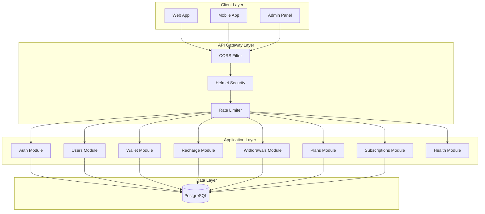

---

## Module Architecture

### Module Dependency Graph

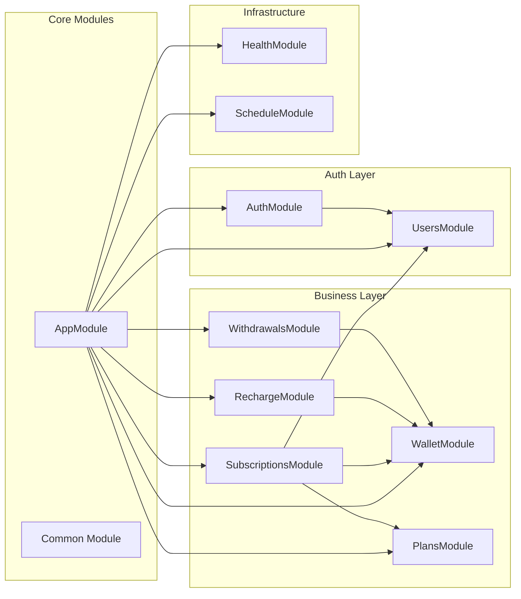

### Module Structure Pattern

Each module follows a consistent structure:

```
module/
├── module.module.ts       # Module definition
├── module.controller.ts   # HTTP endpoints
├── module.service.ts      # Business logic
├── module.entity.ts       # TypeORM entity
├── dto/
│   ├── create-*.dto.ts    # Create DTOs
│   └── update-*.dto.ts    # Update DTOs
└── enums/                 # Module enums (optional)
```

---

## Database Schema

### Entity Relationship Diagram

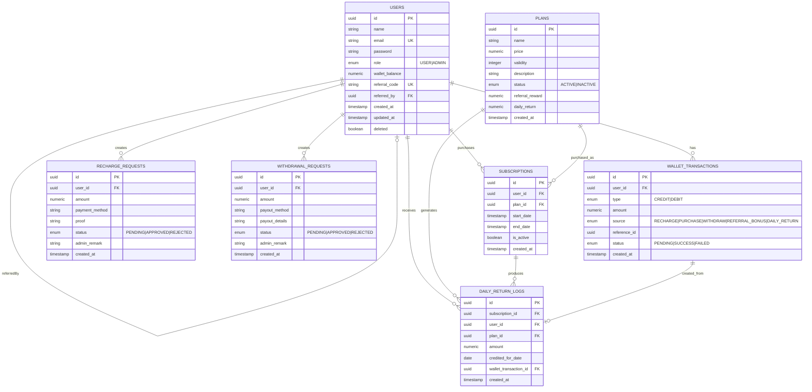

### Database Indexes

| Table | Index Name | Columns | Purpose |
|-------|------------|---------|---------|
| `users` | `IDX_user_email` | `email` | Unique email lookup |
| `users` | `IDX_user_referral_code` | `referral_code` | Referral lookup |
| `users` | `IDX_user_referred_by` | `referred_by` | Referrer queries |
| `wallet_transactions` | `IDX_wallet_tx_user_status` | `user_id, status` | Balance calculation |
| `wallet_transactions` | `IDX_wallet_tx_user_created` | `user_id, created_at` | Ledger queries |
| `recharge_requests` | `IDX_recharge_status` | `status` | Pending list |
| `withdrawal_requests` | `IDX_withdrawal_status` | `status` | Pending list |
| `subscriptions` | `IDX_subscription_user_active` | `user_id, is_active` | Active subscription |
| `plans` | `IDX_plan_status` | `status` | Active plans |
| `daily_return_logs` | `UQ_daily_return_subscription_date` | `subscription_id, credited_for_date` | Prevent duplicate credits |
| `daily_return_logs` | `IDX_daily_return_user` | `user_id` | User's return history |
| `daily_return_logs` | `IDX_daily_return_date` | `credited_for_date` | Date-based queries |

---

## Authentication Flow

### Registration Flow

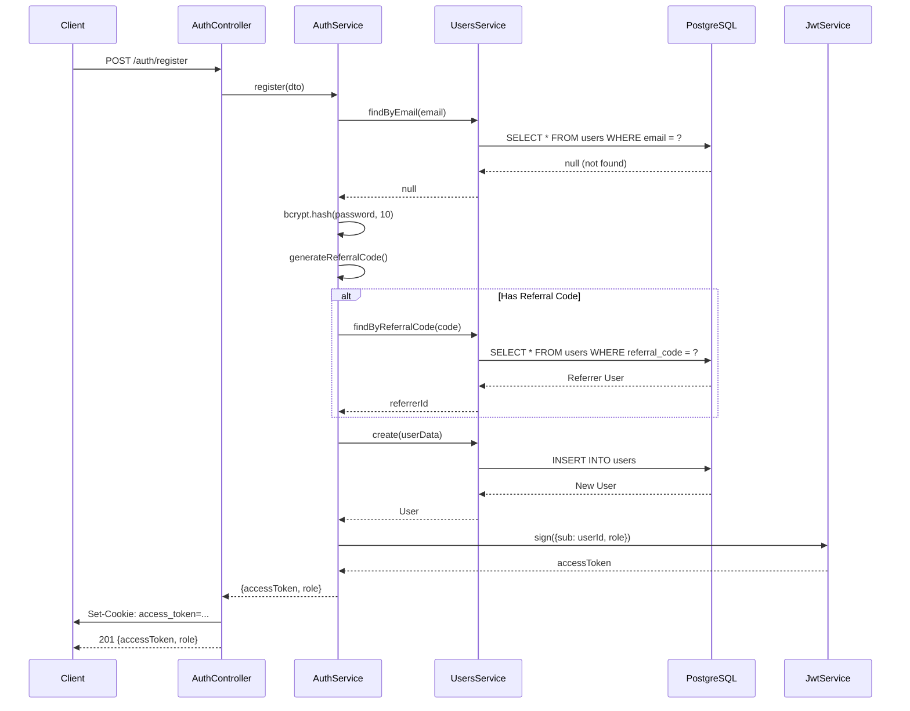

### Login Flow

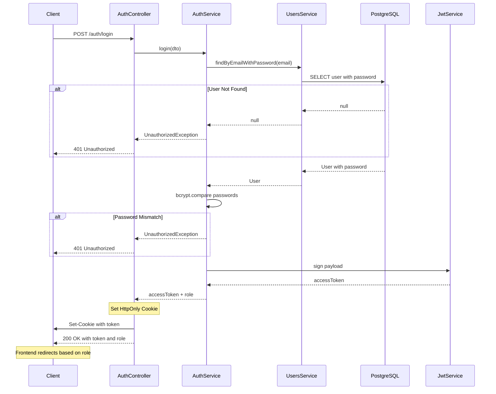

### JWT Authentication Guard Flow

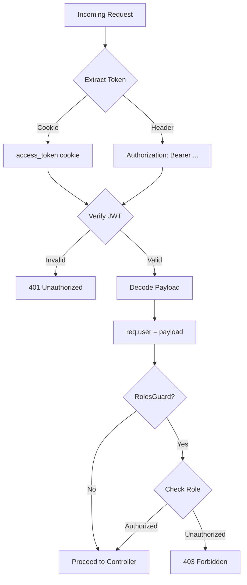

---

## Financial Transaction Safety

### Race Condition Prevention

> [!IMPORTANT]
> All financial operations use **database transactions with pessimistic locking** to prevent race conditions.

### Wallet Debit Flow (with Pessimistic Locking)

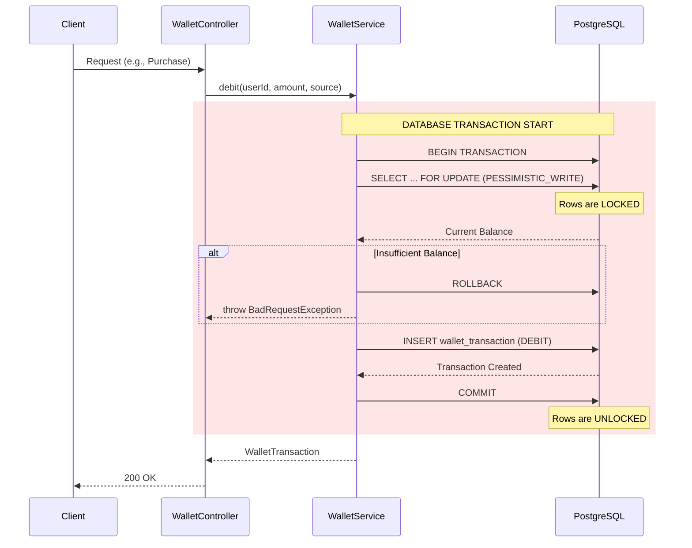

### Subscription Purchase (Atomic Transaction)

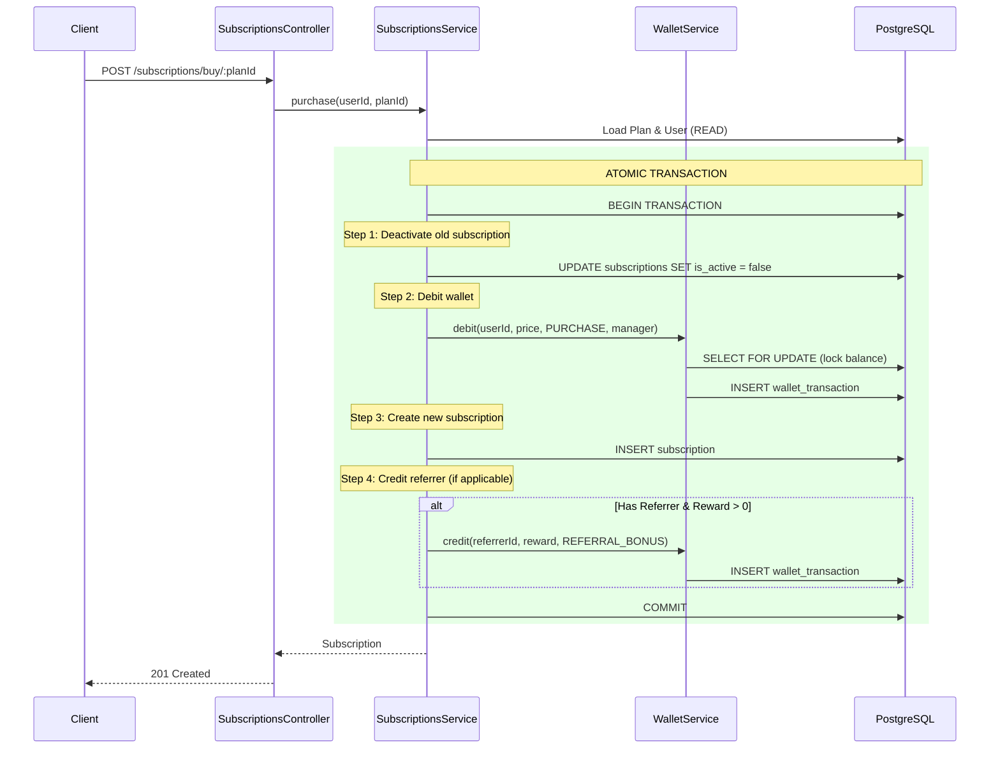

### Withdrawal Flow

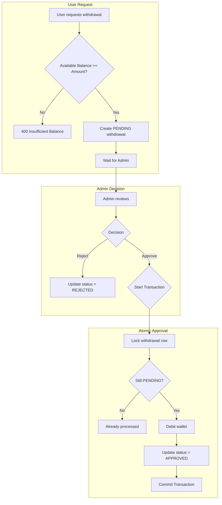

---

## API Endpoints

### Authentication

| Method | Endpoint | Auth | Role | Description |
|--------|----------|------|------|-------------|
| `POST` | `/api/v1/auth/register` | ❌ | - | Register new user |
| `POST` | `/api/v1/auth/login` | ❌ | - | Login (returns role) |
| `POST` | `/api/v1/auth/logout` | ✅ | ANY | Logout (clear cookie) |

### Users

| Method | Endpoint | Auth | Role | Description |
|--------|----------|------|------|-------------|
| `GET` | `/api/v1/users/me` | ✅ | ANY | Get current user |
| `PATCH` | `/api/v1/users/me` | ✅ | ANY | Update current user |
| `GET` | `/api/v1/users` | ✅ | ADMIN | List all users (paginated) |
| `GET` | `/api/v1/users/:id` | ✅ | ADMIN | Get user by ID |
| `PATCH` | `/api/v1/users/:id` | ✅ | ADMIN | Update user (inc. role) |

### Wallet

| Method | Endpoint | Auth | Role | Description |
|--------|----------|------|------|-------------|
| `GET` | `/api/v1/wallet/balance` | ✅ | USER | Get my balance |
| `GET` | `/api/v1/wallet/transactions` | ✅ | USER | Get my transactions |
| `GET` | `/api/v1/wallet/all` | ✅ | ADMIN | All transactions (paginated) |
| `GET` | `/api/v1/wallet/balance/:userId` | ✅ | ADMIN | Get user balance |
| `GET` | `/api/v1/wallet/transactions/:userId` | ✅ | ADMIN | Get user transactions |

### Recharges

| Method | Endpoint | Auth | Role | Description |
|--------|----------|------|------|-------------|
| `POST` | `/api/v1/recharges` | ✅ | USER | Request recharge |
| `GET` | `/api/v1/recharges/my` | ✅ | USER | My recharges |
| `GET` | `/api/v1/recharges/pending` | ✅ | ADMIN | Pending recharges |
| `GET` | `/api/v1/recharges` | ✅ | ADMIN | All recharges |
| `PATCH` | `/api/v1/recharges/:id` | ✅ | ADMIN | Approve/Reject |

### Withdrawals

| Method | Endpoint | Auth | Role | Description |
|--------|----------|------|------|-------------|
| `POST` | `/api/v1/withdrawals` | ✅ | USER | Request withdrawal |
| `GET` | `/api/v1/withdrawals/my` | ✅ | USER | My withdrawals |
| `GET` | `/api/v1/withdrawals/pending` | ✅ | ADMIN | Pending withdrawals |
| `GET` | `/api/v1/withdrawals` | ✅ | ADMIN | All withdrawals |
| `PATCH` | `/api/v1/withdrawals/:id` | ✅ | ADMIN | Approve/Reject |

### Plans

| Method | Endpoint | Auth | Role | Description |
|--------|----------|------|------|-------------|
| `GET` | `/api/v1/plans` | ❌ | - | List active plans |
| `GET` | `/api/v1/plans/:id` | ❌ | - | Get plan details |
| `POST` | `/api/v1/plans` | ✅ | ADMIN | Create plan |
| `PATCH` | `/api/v1/plans/:id` | ✅ | ADMIN | Update plan |
| `PATCH` | `/api/v1/plans/:id/activate` | ✅ | ADMIN | Activate plan |
| `PATCH` | `/api/v1/plans/:id/deactivate` | ✅ | ADMIN | Deactivate plan |
| `DELETE` | `/api/v1/plans/:id` | ✅ | ADMIN | Soft delete plan |
| `GET` | `/api/v1/plans/admin/all` | ✅ | ADMIN | All plans (paginated) |

### Subscriptions

| Method | Endpoint | Auth | Role | Description |
|--------|----------|------|------|-------------|
| `POST` | `/api/v1/subscriptions/buy/:planId` | ✅ | USER | Purchase plan |
| `GET` | `/api/v1/subscriptions/me` | ✅ | USER | My active subscription |
| `GET` | `/api/v1/subscriptions` | ✅ | ADMIN | All subscriptions (paginated) |
| `GET` | `/api/v1/subscriptions/daily-returns/my` | ✅ | USER | My daily return logs |
| `GET` | `/api/v1/subscriptions/daily-returns` | ✅ | ADMIN | All daily returns (paginated) |
| `POST` | `/api/v1/subscriptions/daily-returns/trigger` | ✅ | ADMIN | Manually trigger daily returns |

### Dashboard

| Method | Endpoint | Auth | Role | Description |
|--------|----------|------|------|-------------|
| `GET` | `/api/v1/dashboard/summary` | ✅ | ADMIN | Dashboard summary metrics |
| `GET` | `/api/v1/dashboard/charts` | ✅ | ADMIN | Chart data for visualizations |

### Schemas

| Method | Endpoint | Auth | Role | Description |
|--------|----------|------|------|-------------|
| `GET` | `/api/v1/schemas` | ❌ | - | List form schema names |
| `GET` | `/api/v1/schemas/:name` | ❌ | - | Get form schema by name |
| `GET` | `/api/v1/schemas/grids` | ❌ | - | List grid schema names |
| `GET` | `/api/v1/schemas/grid/:name` | ❌ | - | Get grid schema by name |

### Health

| Method | Endpoint | Auth | Role | Description |
|--------|----------|------|------|-------------|
| `GET` | `/health` | ❌ | - | Application health |
| `GET` | `/health/db` | ❌ | - | Database health |


---

## Request Lifecycle

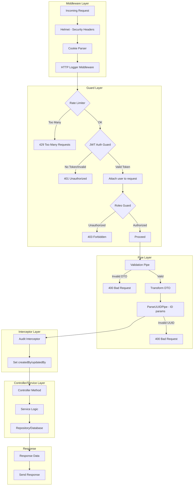

---

## Security Implementation

### Defense Layers

```mermaid
flowchart LR
    subgraph "Layer 1: Network"
        A[CORS Whitelist]
        B[Helmet Headers]
    end
    
    subgraph "Layer 2: Rate Limiting"
        C[60 req/min default]
        D[Throttle Guard]
    end
    
    subgraph "Layer 3: Authentication"
        E[JWT Tokens]
        F[HttpOnly Cookies]
        G[Token Expiry]
    end
    
    subgraph "Layer 4: Authorization"
        H[Role-based Access]
        I[Resource Ownership]
    end
    
    subgraph "Layer 5: Validation"
        J[DTO Validation]
        K[UUID Validation]
        L[Whitelist Fields]
    end
    
    subgraph "Layer 6: Data"
        M[Bcrypt Passwords]
        N[Soft Deletes]
        O[Audit Fields]
    end
    
    A --> B --> C --> D --> E --> F --> G --> H --> I --> J --> K --> L --> M --> N --> O
```

### Security Headers (Helmet)

```
Content-Security-Policy: default-src 'self'
X-DNS-Prefetch-Control: off
X-Frame-Options: SAMEORIGIN
X-Content-Type-Options: nosniff
X-XSS-Protection: 0
Referrer-Policy: no-referrer
Strict-Transport-Security: max-age=15552000; includeSubDomains
```

### Cookie Security

```typescript
{
  httpOnly: true,          // Not accessible via JavaScript
  secure: true,            // HTTPS only in production
  sameSite: 'lax',         // CSRF protection
  maxAge: 24 * 60 * 60 * 1000  // 24 hours
}
```

---

## CRUD Infrastructure

### Base Classes Hierarchy

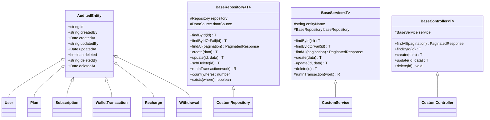

### Pagination Response Format

All paginated endpoints return:

```json
{
  "data": [...],
  "meta": {
    "page": 1,
    "limit": 20,
    "totalItems": 100,
    "totalPages": 5,
    "hasNextPage": true,
    "hasPreviousPage": false
  }
}
```

---

## Deployment Configuration

### Environment Variables

| Variable | Required | Default | Description |
|----------|----------|---------|-------------|
| `PORT` | ❌ | 3000 | Server port |
| `NODE_ENV` | ❌ | development | Environment |
| `DB_HOST` | ✅ | - | PostgreSQL host |
| `DB_PORT` | ❌ | 5432 | PostgreSQL port |
| `DB_USER` | ✅ | - | Database user |
| `DB_PASS` | ✅ | - | Database password |
| `DB_NAME` | ✅ | - | Database name |
| `DB_POOL_SIZE` | ❌ | 20 | Connection pool size |
| `JWT_SECRET` | ✅ | - | JWT signing secret |
| `JWT_EXPIRES_IN` | ❌ | 1d | Token expiration |
| `ALLOWED_ORIGINS` | ❌ | - | CORS whitelist (comma-separated) |
| `THROTTLE_TTL` | ❌ | 60000 | Rate limit window (ms) |
| `THROTTLE_LIMIT` | ❌ | 60 | Requests per window |
| `DAILY_RETURNS_CRON` | ❌ | `0 1 * * *` | Daily returns cron (1 AM) |

### Production Checklist

- [ ] Set `NODE_ENV=production`
- [ ] Configure `ALLOWED_ORIGINS` (no wildcard)
- [ ] Use strong `JWT_SECRET` (32+ chars)
- [ ] Enable HTTPS (Secure cookies require it)
- [ ] Set up database connection pooling
- [ ] Configure rate limiting appropriately
- [ ] Set up structured logging
- [ ] Configure health checks for load balancer
- [ ] Enable graceful shutdown hooks

---

## Summary

This wallet system implements a production-ready financial backend with:

✅ **Atomic Financial Operations** - Database transactions prevent race conditions  
✅ **Role-Based Access Control** - Admin and User roles with proper guards  
✅ **Secure Authentication** - JWT tokens in HttpOnly cookies  
✅ **Comprehensive Validation** - DTO validation and UUID checking  
✅ **Rate Limiting** - Protection against abuse  
✅ **Soft Deletes** - Data preservation with audit trails  
✅ **Reusable CRUD Infrastructure** - Base classes reduce boilerplate  
✅ **Pagination Support** - All list endpoints paginated  
✅ **Health Monitoring** - Database and application health checks  
✅ **Daily Returns** - Automated daily credits for subscribers

---

## Daily Returns System

### Overview

Subscribers automatically receive daily credits based on their plan's `dailyReturn` value.

### Plan Configuration

| Field | Type | Description |
|-------|------|-------------|
| `dailyReturn` | numeric | Amount credited daily to subscriber |

### Daily Returns Flow

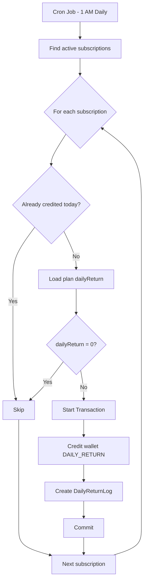

### Duplicate Prevention

- `DailyReturnLog` table with unique constraint on `(subscriptionId, creditedForDate)`
- Each credit logged before processing next subscription

### Wallet Transaction Source

Daily returns appear in wallet with source = `DAILY_RETURN`
